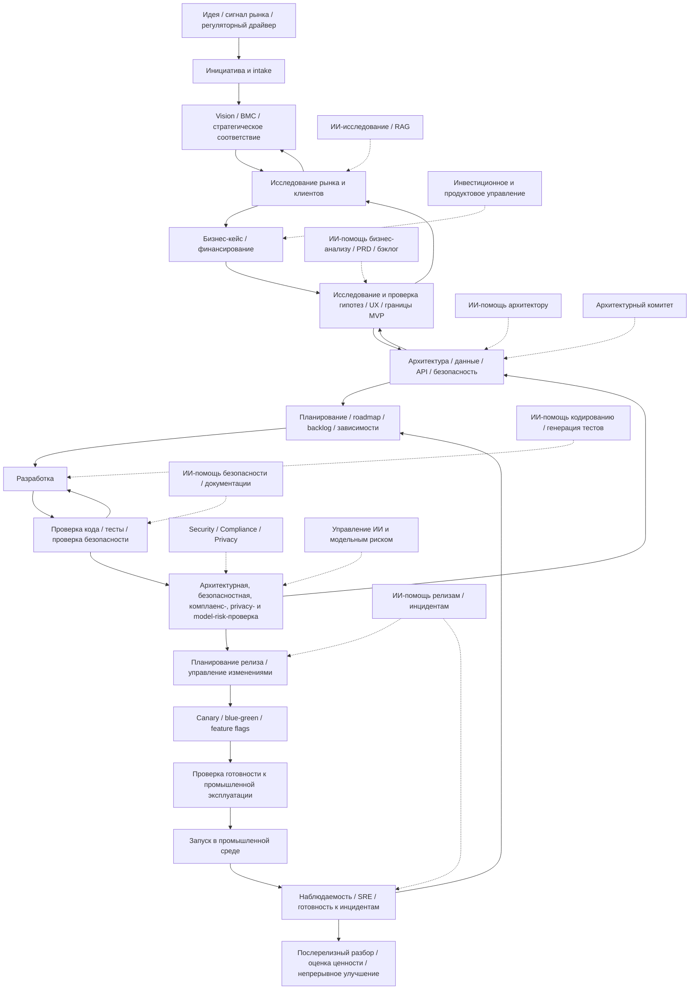
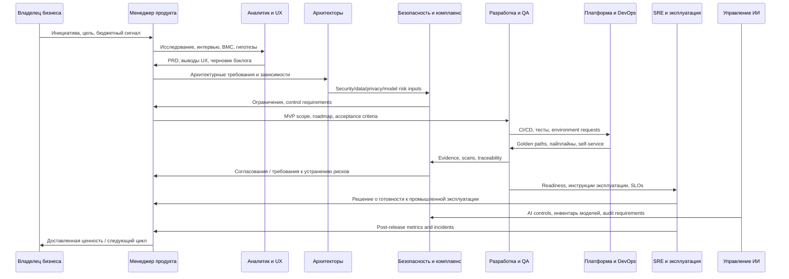
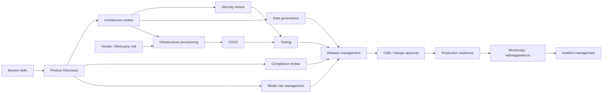
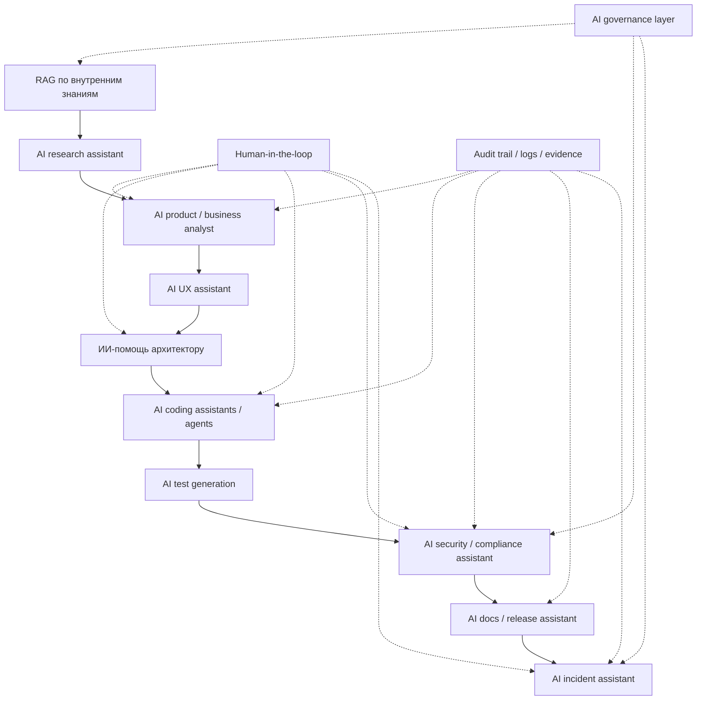

# Процесс разработки ПО с поддержкой ИИ в крупной финтех-корпорации

Навигация: [DataCanvas](../../../README.md) / [Документация](../../README.md) / [Процесс](../README.md) / [Методика проектной документации](README.md) / Процесс разработки ПО с поддержкой ИИ

Статус: active
Владелец: Process Owner
Проверка: `npm run validate:documentation-methodology`

Актуальный очищенный источник: этот Markdown-документ. PDF и DOCX сохранены рядом как исходные сопутствующие форматы: [PDF](ai-enabled-software-development-process-research.pdf), [DOCX](ai-enabled-software-development-process-research.docx).

## Как читать сокращения

- **AI** — artificial intelligence, искусственный интеллект.
- **LLM** — large language model, большая языковая модель.
- **RAG** — retrieval-augmented generation, генерация ответа с поиском по базе знаний.
- **PDLC/SDLC** — жизненный цикл продукта / жизненный цикл разработки ПО.
- **DORA, SRE, DevOps, DevSecOps, MLOps, LLMOps** — устойчивые технические обозначения практик и метрик; дальше они используются как точные сокращения.

## Краткое резюме

У крупных корпораций не существует единого универсального стандарта **AI PDLC**. На практике под этим обычно понимают не новый «отдельный» жизненный цикл, а расширение классического **PDLC/SDLC** за счет AI-слоя: корпоративного поиска и RAG, генерации артефактов, агентных помощников, AI-кодинга, генерации тестов, автоматизации контроля качества, а также обязательных контуров **AI governance**, **model risk management**, журналирования и human-in-the-loop. Наиболее надежные опорные рамки для такой модели сегодня — **NIST SSDF** для безопасной разработки, **NIST AI RMF** для управления рисками ИИ, DORA для метрик поставки, SRE и практик наблюдаемости для эксплуатации.

Глобальный тренд уже не сводится к «подсказкам в IDE». По данным **DORA 2025**, почти 90% специалистов по разработке и продукту используют ИИ в рабочих процессах, медианное время работы с ИИ — около двух часов в день; 65% респондентов сообщают о заметной зависимости от ИИ, более 80% — о росте продуктивности, 59% — о положительном влиянии на качество кода. Но доверие остается ограниченным: только 24% сообщили о высоком доверии к ИИ-выводам. Похожую картину показывает **Stack Overflow 2025**: 84% разработчиков используют или планируют использовать ИИ, 51% профессиональных разработчиков применяют его ежедневно, но 66% раздражают «почти правильные» ответы, а недоверяющих точности ИИ больше, чем доверяющих.

Главный практический вывод для корпорации такой: если ускорить только кодирование, выигрыш будет ограниченным. **Bain** указывает, что написание и тестирование кода — это лишь около 25–35% времени от идеи до запуска, поэтому без ускорения discovery, требований, согласований, тестовых данных, проверок безопасности и релиза узкие места просто смещаются дальше по потоку. Именно поэтому зрелые компании переходят от «AI-assisted coding» к **AI-enabled delivery system**: внутренним developer platforms, golden paths, self-service-инфраструктуре, автоматизированным review-gates и централизованной базе знаний.

Эффект по времени неоднороден. С одной стороны, полевые эксперименты на почти 4 867 разработчиках в Microsoft, Accenture и компании Fortune 100 показали в среднем **+26,08%** к числу завершенных задач при доступе к AI coding assistant, причем более выраженный эффект наблюдался у менее опытных разработчиков. С другой стороны, исследование **METR** на опытных open-source сопровождающих зрелых репозиториев показало в одном конкретном сценарии **замедление на 19%** для ранних инструментов 2025 года; сами авторы отдельно предупредили, что это снимок определенного режима работы и что более поздние инструменты меняют картину. Следовательно, корректная позиция для корпорации — считать ускорение **контекстно-зависимым**, а не универсальным.

Для регулируемого финтеха это означает следующее. Реалистичный выигрыш появляется не столько от «магического» кода, сколько от сочетания семи факторов: единого intake-процесса инициатив, сильного discovery, стандартизованных архитектурных шаблонов, автоматизированных тестов, DevSecOps-gates, хорошей наблюдаемости, а также безопасного корпоративного ИИ-контура с политиками данных, журналированием и контролем моделей. В такой конфигурации end-to-end цикл «идея → production» действительно может сокращаться, но обычно не «в разы» на всем потоке, а на десятки процентов. Наиболее вероятный диапазон для крупной регулируемой организации сегодня — **примерно 10–30%** для AI-assisted режима и **20–45%** для AI-native режима при высокой зрелости платформы и процессов; уверенность по этим диапазонам — средняя, потому что они являются синтезом нескольких источников, а не единым отраслевым стандартом.

**Факт.** ИИ уже массово встроен в разработку, но доверие, качество и организационная готовность отстают от скорости внедрения.

**Вывод.** Для крупной корпорации полезно проектировать не просто AI coding, а **AI PDLC как операционную систему поставки изменений**.

**Рекомендация.** Базовая целевая модель — один корпоративный процесс с тремя слоями: **product governance**, **engineering delivery**, **AI/risk governance**.

**Риск.** Если не перестроить проверки, релизы, документацию и ownership, ИИ увеличит локальную скорость, но может ухудшить общесистемное качество и устойчивость.

## Термины и сдвиг мирового тренда

**SDLC** — это жизненный цикл разработки программного обеспечения; практический ориентир для корпораций сегодня — безопасная разработка по **NIST SSDF**, который группирует практики в четыре блока: подготовка организации, защита ПО, выпуск хорошо защищенного ПО и постоянное реагирование на уязвимости. Это уже не только «девелопмент», а связка требований, сборки, provenance, сканирования, тестирования и реакции на дефекты.

**PDLC** — более широкий жизненный цикл продукта: от идеи, исследования рынка и клиента, vision, BMC/Lean Canvas, business case и discovery до выпуска, масштабирования и continuous improvement. Публичные исследования McKinsey по product management и PDLC показывают, что ИИ дает эффект именно на этом уровне: в discovery, генерации артефактов, backlog, PRD и market research, а не только в коде.

**DevOps** — культурный и процессный подход, объединяющий разработку и эксплуатацию ради более быстрой и надежной поставки. **Platform engineering** — не замена DevOps, а его индустриализация: выделенная команда строит **internal developer platform** с golden paths и self-service-механикой, чтобы уменьшить когнитивную нагрузку и спрятать сложность инфраструктуры, безопасности и CI/CD за стандартными шаблонами. Это особенно важно в корпорациях с сотнями разработчиков и множеством команд.

**DevSecOps** — это DevOps с встроенными security-практиками по всему потоку. В корпоративной реализации это означает security requirements до начала разработки, сканирования и политики как код в пайплайнах, контроль зависимостей и supply chain, secure defaults в шаблонах и risk-based remediation после релиза. NIST SSDF и практики платформенной инженерии хорошо стыкуются именно в таком режиме.

**MLOps** — комбинация людей, процессов и технологий для промышленной поставки классических ML-решений. **GenAIOps/LLMOps** расширяют MLOps на генеративные модели: добавляются prompt management, evaluation недетерминированных результатов, безопасность против prompt injection, контроль стоимости, RAG, агентные цепочки и более сильный human-in-the-loop. AWS прямо отмечает, что генеративные решения создают новые проблемы: недетерминированность, системную сложность, риск утечек и высокую стоимость, а также требуют отдельных ролей — prompt engineers, prompt testers и GenAI developers.

**AI PDLC** в строгом смысле еще не стал единым стандартом, но как рабочий термин он полезен: это **PDLC + Secure SDLC + GenAIOps + AI governance**. Для крупной компании практический состав AI PDLC такой: AI-assisted discovery, AI-generated artifacts, AI coding/review/test, корпоративный RAG, automated gates, инвентарь моделей, evaluation, журнал проверяемых действий, human oversight, post-release monitoring модели и приложения. Такой подход соответствует логике **NIST AI RMF** — Govern, Map, Measure, Manage — и банковскому model risk management, где обязательны инвентаризация моделей, независимая проверка, мониторинг, документирование ограничений и governance на уровне руководства.

Рынок движется от **AI-assisted development** к **agentic software engineering**. Это видно по появлению корпоративных агентных контуров: GitHub описывает собственный **agentic harness**, который управляет контекстом, инструментами и workflow поверх разных моделей; OpenAI позиционирует **Codex** как облачного агента-разработчика, способного параллельно писать фичи, исправлять дефекты, отвечать по кодовой базе и предлагать pull requests. Важно, что оба вендора подчеркивают не только модель, но и слой orchestration/harness — именно он и становится новым ядром AI-native delivery.

## Целевая карта корпоративного процесса

Ниже — **синтезированная целевая модель** для крупного финтеха. Это не «официальный стандарт одной компании», а практический каркас, собранный из NIST SSDF, NIST AI RMF, DORA, платформенной инженерии, SRE и публичных инженерных практик крупных компаний вроде Netflix и Capital One. В такой модели процесс строится как единый поток от идеи до эксплуатации, а проверки безопасности, данных, модели, релиза и надежности встроены внутрь потока, а не вынесены в конец.

### Верхнеуровневая карта процесса

Эта логика соответствует выводу Bain: если ИИ ускоряет код, то review, интеграция, тестирование и релиз тоже должны ускоряться, иначе бутылочное горлышко смещается дальше. Netflix-среда исторически индустриализировала delivery через Spinnaker и автоматизированные пайплайны; platform engineering в Google Cloud и Atlassian прямо строится вокруг golden paths, templating и self-service, чтобы «правильный путь» был самым простым для команды.

### Диаграмма взаимодействия ролей

В зрелой модели PM/BA/UX перестают быть только «писателями документов»: они управляют качеством входов в систему доставки. Архитекторы и security смещаются левее — не на финальный «стоп-кран», а в стадию design governance. Платформенная команда превращает нестандартизированные практики DevOps в продукт для внутренних разработчиков. SRE удерживает reliability через SLO, наблюдаемость и incident readiness. Для AI-функций добавляется AI governance/model risk слой, особенно там, где ИИ влияет на клиентские решения или критические операции.

### Подробная таблица этапов

Ниже приведена **синтезированная** таблица этапов. Сроки — ориентиры для крупной регулируемой организации; они основаны на сочетании исследований по продуктивности PM и разработчиков, данных DORA, Bain, McKinsey, GitHub/Accenture, а также на том факте, что кодинг — лишь часть цикла. Поэтому относитесь к диапазонам как к моделированию, а не к нормативу.

| Этап | Цель и ключевые действия | Основные артефакты | Основные гейты | ИИ-ускорители | Типовой срок без ИИ | Типовой срок с ИИ |
|---|---|---|---|---|---:|---:|
| Intake идеи | Зафиксировать инициативу и owner | idea brief, sponsor note | intake triage | AI research assistant, авто-классификация | 2–5 дней | 1–3 дня |
| Vision и бизнес-рамка | Сформировать vision, BMC/Lean Canvas, целевой эффект | vision, BMC, hypothesis map | product sponsor | AI PM/BA, шаблоны артефактов | 1–3 нед. | 3–10 дней |
| Market/client/regulatory research | Изучить рынок, клиента, конкурентов, ограничения | research pack, customer insights | PM/strategy/legal check | AI research, RAG, synthesis | 2–6 нед. | 1–4 нед. |
| Бизнес-кейс | Оценить выгоду, риск, стоимость, ROI | business case, finance model | investment committee | AI analyst, расчеты, проект черновиков | 2–6 нед. | 1–4 нед. |
| Discovery и MVP scope | Проверить гипотезы, UX, define MVP | PRD, UX prototype, backlog v1 | discovery review | AI UX, AI BA, story generation | 2–8 нед. | 1–5 нед. |
| Архитектура и данные | Спроектировать solution/data/API/security architecture | SAD, data model, API spec | architecture board | ИИ-помощь архитектору, dependency mining | 2–6 нед. | 1–4 нед. |
| Security/privacy/compliance/model risk design | Зафиксировать обязательные контроли | threat model, privacy assessment, control matrix, инвентарь моделей | Security/Compliance/Data/AI Gov | AI control drafting, evidence prep | 2–6 нед. | 1–4 нед. |
| Планирование и зависимости | Упаковать roadmap, ресурсы, межкомандные связи | roadmap, RAID, карта зависимостей | portfolio / delivery planning | AI dependency analysis | 1–3 нед. | 3–7 дней |
| Разработка | Реализовать функциональность | code, tests, docs | PR checks | AI coding, pair programming | 2–16 нед. | 1.5–12 нед. |
| Верификация | Unit/integration/e2e/security/load | evidence pack, test report | quality gate | AI test generation, log analysis | 2–8 нед. | 1–5 нед. |
| Release/change | Подготовить rollout и change record | rollout plan, change record, runbook | release/CAB where needed | AI release assistant | 3–10 дней | 1–5 дней |
| Prod readiness и запуск | Проверить readiness, выкатить безопасно | PRR checklist, SLOs, dashboards | PRR approval | AI documentation + release checks | 3–10 дней | 1–5 дней |
| Эксплуатация и улучшение | Мониторинг, инциденты, value tracking | PIR, KPI pack, backlog v2 | ops review | AI incident assistant, knowledge base | непрерывно | непрерывно |

### Диаграмма зависимых подпроцессов

Для финтеха критично не терять эти зависимости из вида: именно тут чаще всего и «умирает» обещанное ускорение. Банковское model risk guidance требует robust development, validation, governance, inventory и ongoing monitoring моделей; NIST AI RMF требует документированного Govern/Map/Measure/Manage-подхода и явных процессов human oversight; SSDF требует встроенного реагирования на уязвимости, а не только сканирования перед релизом.

## AI PDLC и оценка ускорения

### Что именно меняет AI PDLC

На этапе идеи и strategy ИИ прежде всего ускоряет **сбор и синтез информации**: рынок, конкуренты, клиентские боли, регуляторные ограничения, внутренние знания из Confluence/Jira/Git/архитектурных решений. На этапе discovery и product management наибольший эффект проявляется в генерации market research, one-pagers, PRD, backlog и customer-facing текстов. В исследовании McKinsey по PM это дало **около 5% ускорения time-to-market на шестимесячном PDLC**, **40% рост продуктивности PM** и заметный рост качества deliverables у более опытных PM.

На инженерных стадиях ИИ больше всего помогает в четырех зонах: стартовый черновик кода, документация, рефакторинг и генерация тестов. McKinsey фиксировал в controlled-study, что документирование и написание нового кода могли выполняться примерно вдвое быстрее, а для более сложных задач разработчики с ИИ были на 25–30% вероятнее уложиться в заданное время. Но полевые данные более консервативны: Bain пишет о типичных фактических **10–15%** приростах в командах, а не о кратных ускорениях; MIT/Princeton/Microsoft/Wharton на трех корпоративных экспериментах показали **26,08%** прирост completed tasks.

После кода главный эффект AI PDLC — в том, что ИИ начинает работать и как **«второй слой контроля»**: генерация и пополнение тестов, подготовка security evidence, суммаризация diff/PR, помощь в подготовке заметок к релизу, инструкции эксплуатации, postmortems и разбор инцидентов. GitHub/Accenture сообщили, что разработчики в среднем принимали около **30%** предложений Copilot, быстро запускали инструмент в ежедневную работу, а опросы показывали улучшение удовлетворенности и снижение ментальной нагрузки; GitHub также подчеркивает, что оценивать эффект надо через telemetry и организационные метрики, а не только через субъективные ощущения.

Наконец, AI PDLC меняет и саму операционную механику. Появляется отдельный AI-слой с корпоративный RAG, реестр промптов и навыков, evals, routing, журнал проверяемых действий и агентами по ролям. OpenAI Codex уже позиционируется как software engineering agent, работающий параллельно по нескольким задачам; GitHub описывает shared agentic harness; AWS делает отдельный акцент на GenAIOps, где prompt management, evaluation недетерминированных ответов и orchestration составляют отдельную дисциплину. Это важный сдвиг: центр тяжести уходит от «IDE-подсказок» к **агентным конвейерам работы с кодом и знаниями**.

### AI-native диаграмма

### Сравнительная оценка сроков

Это **экспертная модель с опорой на источники**, а не отраслевой норматив. Она исходит из трех подтвержденных фактов: PM-часть и discovery действительно ускоряются, coding/testing ускоряются неодинаково в зависимости от контекста, а end-to-end эффект ограничен узкими местами downstream-процессов.

| Сценарий | Идея → согласованный бизнес-кейс | Бизнес-кейс → MVP | MVP → готовность к промышленной эксплуатации | Полный цикл: идея → запуск | Уверенность |
|---|---:|---:|---:|---:|---|
| Классический корпоративный процесс | 6–16 нед. | 12–40 нед. | 4–12 нед. | 6–18 мес. | Средняя |
| Современный процесс с AI-assisted tools | 4–12 нед. | 10–32 нед. | 3–10 нед. | 5–14 мес. | Средняя |
| AI-native / AI PDLC — процесс полного цикла с глубокой поддержкой ИИ | 3–10 нед. | 8–28 нед. | 2–8 нед. | 4–12 мес. | Низкая–средняя |

Для **small initiative** в регулируемой среде разумный ориентир — примерно **4–8 месяцев** без выраженного ИИ, **3.5–7 месяцев** с AI-assisted и **3–6 месяцев** в AI-native режиме. Для **medium initiative** — примерно **8–15 / 6–12 / 5–10 месяцев**. Для **large initiative** с legacy, множеством интеграций и тяжелыми согласованиями — **15–30 / 12–24 / 10–20 месяцев**. Для менее регулируемой цифровой среды эти диапазоны обычно короче примерно на **15–30%**, потому что меньше privacy/compliance/model risk/change gates. Это суждение имеет **среднюю** уверенность для первых двух режимов и **низкую–среднюю** для AI-native, так как рынок еще быстро меняется.

### Где ускорение максимально вероятно

Наиболее устойчивые точки ускорения сегодня — это подготовка research-пакетов, synthesis внутренних знаний, создание стандартных артефактов, backlog decomposition, черновики архитектурных вариантов, генерация unit- и integration-тестов, суммаризация PR, инструкции эксплуатации, подготовка заметок к релизу, triage логов и пост-инцидентный разбор. Наоборот, наименее автоматизируемые зоны — утверждение стратегии, выбор риск-аппетита, итоговые решения по архитектурным компромиссам, high-risk AI approvals, выпуск в критичных платежных или клиентских операциях и финальное итоговое согласование по комплаенсу. Именно здесь human-in-the-loop остается обязательным.

## Регламенты, метрики, SWOT и проблемные зоны

### Ключевые регламенты и контрольные контуры

Для крупной корпорации регламенты делятся на три пласта. Первый — **product/portfolio governance**: intake, приоритизация, funding, investment committee, stage gates. Второй — **engineering governance**: architecture review, secure SDLC, testing standards, definition of ready/done, release/change management, production readiness, incident management и post-implementation review. Третий — **AI/risk governance**: inventory моделей, правила использования external AI services, quality/evaluation criteria, privacy controls, human oversight, incident register и policy на случай недоступности ИИ. Такой трехслойный контур хорошо согласуется с NIST SSDF, AI RMF, SR 11-7 и текущими рекомендациями Банка России.

Особое внимание в финтехе нужно уделять **model risk management** и **third-party AI risk**. Банковский надзор США требует robust development, independent validation, ongoing monitoring, board-level governance и inventory всех моделей. NIST AI RMF дополнительно требует документированных процессов human oversight, risk treatment и контроля сторонних компонентов и данных. Поэтому любая AI-функция, влияющая на кредитные решения, антифрод, идентификацию, клиентскую сегментацию, приоритизацию жалоб, рекомендации или критические операции, должна попадать в инвентарь, классификацию риска и цикл регулярной валидации.

В доставке изменений сохраняют значение **feature flags**, **canary**, **blue-green** и, где требуется, **CAB/change approvals**. Google и Kubernetes документируют canary как прогрессивный rollout с частичным трафиком; AWS определяет blue/green как развертывание двух идентичных production-окружений ради снижения риска и быстрого отката; ServiceNow по-прежнему описывает CAB как группу, оценивающую, приоритизирующую, авторизующую и планирующую изменения. Для крупного финтеха практическая политика обычно такова: частые low-risk релизы уводятся в автоматизированные gates, а high-risk изменения остаются под усиленным review.

### Управленческие метрики

Основой остаются **DORA-метрики**: change lead time, deployment frequency, failed deployment recovery time, change fail rate и deployment rework rate. Их полезно дополнять SRE-метриками через **SLI/SLO**, а для AI-слоя — acceptance rate подсказок, долю AI-generated code/tests, долю переделок после выводов ИИ, число security/compliance findings на релиз и бизнес-метрики adoption/value realization. DORA подчеркивает, что скорость и стабильность не являются взаимоисключающими величинами; Google SRE определяет SLO как целевой диапазон измеряемого уровня сервиса.

| Группа метрик | Минимальный набор |
|---|---|
| Business value | time-to-market, feature adoption, business value delivered, cost of delay |
| Delivery speed | lead time, cycle time, deployment frequency, PR cycle time, backlog health |
| Quality | defect escape rate, test coverage, rework rate, review latency |
| Reliability | SLI/SLO, MTTR / failed deployment recovery time, production incidents |
| Security & compliance | findings per release, time to remediate, privacy exceptions, audit completeness |
| AI effectiveness | AI acceptance rate, AI-generated code share, AI-generated test share, rework after AI, hallucination / invalid output rate |
| Developer experience | satisfaction, onboarding time, documentation findability, cognitive load proxies |

Практически зрелые организации начинают не с десятков метрик, а с **10–15 главных**, привязывая их к value stream. Для platform engineering Google рекомендует измерять DX через группы наподобие happiness, engagement, adoption, retention и task success; Atlassian показывает, что реальная проблема часто не в темпе кодинга, а в потерях времени на поиск информации, документацию и неэффективность процессов.

### SWOT-анализ AI PDLC в крупных корпорациях

Ниже — **аналитический SWOT**, построенный на исследованиях DORA, McKinsey, Bain, Stack Overflow, NIST и регуляторных источниках.

| Сильные стороны | Слабые стороны |
|---|---|
| Существенно ускоряет сбор и синтез информации | Низкая предсказуемость качества результата модели |
| Ускоряет создание стандартных артефактов | Сильная зависимость от качества контекста и документации |
| Снижает стартовый порог входа в незнакомые кодовые базы | Риск ложного чувства скорости и качества |
| Уменьшает поиск рутинной информации | Нужны новые метрики и оценка ROI |
| Повышает покрытие тестами при правильной настройке | Неравномерный эффект по типам задач и командам |
| Поддерживает refactoring и modernization | Может увеличивать rework при слабом review |
| Улучшает DX и снижает когнитивную нагрузку | Слабая explainability для части решений |
| Помогает в triage инцидентов и документации | Может ухудшать навыки junior-сотрудников без наставничества |
| Масштабирует внутренние знания через RAG | Сложность безопасного подключения к внутренним данным |
| Позволяет стандартизировать golden paths быстрее | Требует перестройки процессов, а не только закупки инструмента |

| Возможности | Угрозы |
|---|---|
| Переход к enterprise AI development platform | Утечки кода, данных и секретов |
| Сокращение time-to-market на всем PDLC | Prompt injection и RAG poisoning |
| Более быстрый modernization legacy | Теневое использование ИИ вне контроля ИБ и комплаенса |
| Лучшая трассируемость знаний и решений | Vendor lock-in на модели, инструменты и контур оценки качества |
| New-product discovery на базе внутренних данных | License/IP-риски по коду и данным |
| Growth в self-service delivery | Смещение узких мест в review и release |
| Более раннее обнаружение дефектов и ошибок дизайна | Рост surface area supply-chain рисков |
| Автоматизация evidence для аудита | Недостаточная проверяемость агентных действий |
| Улучшение наблюдаемости и SRE automation | Regulatory lag и неоднозначность требований |
| Быстрая адаптация ролей и upskilling | Организационное сопротивление и падение доверия |

### Проблемные зоны и популярные действия по устранению

Проблемы, которые чаще всего реально тормозят корпорации, хорошо читаются из исследований о DX, доверии к ИИ и узких мест полного жизненного цикла: разрозненные знания, документация, ручные согласования, слабый платформенный слой, ручное тестирование, недоверие к выводам ИИ и отсутствие governance.

| Проблемная зона | Быстрые меры 1–4 недели | Среднесрочно 1–3 месяца | Стратегически 3–12 месяцев | Владельцы | Роль ИИ | Ожидаемый эффект |
|---|---|---|---|---|---|---|
| Долгий discovery | Единый brief-шаблон, исследовательский пакет с помощью ИИ | RAG по интервью/аналитике | платформа продуктовой аналитики | PM, BA | synthesis, draft artifacts | быстрее discovery |
| Медленный business case | Шаблон финмодели, AI черновики | контрольные этапы по типам инициатив | модель финансирования потоков ценности | Finance, PMO | расчеты и варианты | меньше цикла согласований |
| Разрозненные требования | Обязательный PRD + ADR | трассировка между PRD, бэклогом и тестами | единая граф знаний | BA, Architect | link/summarize | меньше потерь контекста |
| Слабая документация | помощник документации на базе ИИ | критерии качества документации | документация как код + RAG | Tech lead, Platform | автогенерация черновиков | ниже зависимость от незаменимых людей |
| Legacy и сложные зависимости | карта зависимостей | дорожная карта постепенной замены | platform/API modernization | EA, Tech lead | dependency mining | меньше скрытых рисков |
| Медленные security review | заранее согласованные контрольные шаблоны | политики как код | безопасные стандартные пути | Security, Platform | evidence drafting | меньше ручной очереди |
| Медленные compliance/privacy review | стандартные checklists | уровни риска и шаблоны PIA | unified control catalog | Compliance, Legal | draft evidence | быстрее approvals |
| Низкая автоматизация тестов | генерация unit- и integration-тестов с помощью ИИ | стратегия тестовых данных | автоматизированный регрессионный слой | QA, Dev | test gen/oracles | меньше регрессий |
| Слабый CI/CD и release | базовая настройка конвейера | feature flags и canary-развертывание | внутренняя платформа разработки и стандартные пути | Platform, DevOps | заметки к релизу и проверки | рост частоты поставки |
| Низкое доверие к ИИ | правила использования, обучение | evals и карты оценки качества | корпоративный ИИ-портал с governance | CTO, AI Gov | explain/trace | безопасное масштабирование |
| Утечки данных через ИИ | запрет публичных инструментов для конфиденциальных данных | классификация данных + DLP | внутренний контур/одобренные поставщики | CISO, Data owner | masked workflows | снижение риска утечки |
| Теневое использование ИИ | реестр approved tools | телеметрия и контроль соблюдения политик | единый внутренний AI gateway | CISO, CIO | аналитика использования | рост управляемости |
| Неясная ответственность за AI-код | владелец политики и правила владения кодом | матрица проверки для AI outputs | формальная модель ответственности | Eng leadership, Legal | none | меньше правовой неопределенности |
| Непрозрачная окупаемость | 5–10 KPI пилота | витрина окупаемости | экономика ИИ на уровне портфеля | Finance, CTO | analytics | понятный бизнес-эффект |

## Целевая операционная модель и адаптация для России

### Рекомендуемая целевая модель для крупного финтеха

Организационно лучшая модель обычно не «много агентов против людей», а **одна продуктовая команда + платформенная команда + общие контрольные функции**. Продуктовая команда отвечает за value и delivery, platform engineering — за IDP/golden paths/self-service, а security/compliance/data/AI governance дают стандарты, уровни риска и политики как код. Это уменьшает когнитивную нагрузку и позволяет масштабировать лучшие практики без постоянного ручного участия экспертов.

Технологически рекомендуемая конфигурация выглядит так: **внутренний AI-портал** для одобренных сценариев; **корпоративный RAG** по внутренней документации, архитектурным решениям, инструкциям эксплуатации и кодовой базе; **агентная инструментальная цепочка** для research, BA, code, test, docs, release и разбора инцидентов; **контур оценки качества**; **журнал проверяемых действий** всех агентных действий; **реестр моделей и инструментов**; **реестр промптов и навыков**; изолированные среды и управление доступом к репозиториям, секретам и данным по принципу наименьших привилегий. Внешние сервисы допустимы только в разрешенном периметре, с понятными условиями обработки данных и логированием.

Безопасная эксплуатация внешних LLM в корпоративной среде возможна, но требует договорных и технических мер. OpenAI для корпоративных продуктов публично указывает, что по умолчанию **не использует данные организации для обучения моделей**, предоставляет корпоративные и административные средства контроля, а для части рынков — локализацию данных; при этом сама корпорация должна отдельно решить вопросы классификации данных, маскирование, сроки хранения, границы согласования и риск поставщика. Это означает, что «можно использовать» и «можно использовать без ограничений» — разные вещи.

### Дорожная карта на двенадцать месяцев

| Период | Ключевые шаги |
|---|---|
| Квартал первый | утвердить AI policy, роли и уровни риска; выбрать 3–5 пилотных потоков ценности; внедрить базовые генераторы PRD/test/docs; запустить telemetry по DORA и AI-метрикам |
| Квартал второй | поднять internal AI portal; подключить RAG к approved knowledge sources; стандартизировать промпты и навыки; внедрить политики как код для security/compliance evidence |
| Квартал третий | расширить AI на discovery, architecture, testing и разбор инцидентов; создать инвентарь моделей и инструментов; внедрить feature flags/canary как стандарт |
| Квартал четвертый | масштабировать на несколько бизнес-линий; перевести часть reviews в risk-based automation; провести audit пилота; оформить целевую операционную модель и бюджет на масштабирование |

### Адаптация для крупной компании в России

Для России базовая мировая модель в целом применима: intake, vision, discovery, business case, архитектурное управление, Secure SDLC, DevSecOps, CI/CD, PRR, наблюдаемость, SRE, AI governance и инвентарь моделей. Но контур нужно адаптировать к локальным требованиям по **персональным данным**, **критической информационной инфраструктуре**, требованиям и рекомендациям Банка России по ИБ, а также к ограничениям на использование внешних сервисов и хранение чувствительных данных. Официальные российские источники, на которые опирается такая адаптация, — прежде всего 152‑ФЗ, 187‑ФЗ, рекомендации Банка России по ИИ и безопасности, а также требования к тестированию на проникновение и анализу уязвимостей для организаций финансового рынка.

В 2025–2026 годах Банк России заметно конкретизировал позицию по ИИ в финансовой сфере. В Кодексе этики он зафиксировал пять принципов: **человекоцентричность, справедливость, прозрачность, безопасность/надежность/эффективность и ответственное управление рисками**. Кодекс рекомендует клиенту возможность взаимодействия с человеком, пересмотр решений сотрудником, маркировку контента, созданного большими генеративными моделями, проверку качества данных и качества ИИ, учет моделей и риск-событий, а также контроль сотрудников над решениями ИИ с высоким уровнем риска. Отдельно в 2026 году регулятор выпустил рекомендации по безопасному использованию ИИ в финансовой сфере и прямо указал, что в критически важных процессах с высокими ИБ-рисками, например в платежных операциях, действие, инициированное ИИ, целесообразно подтверждать сотрудником.

Практически это означает такую безопасную модель для России: код, архитектурные документы, журналы, инцидентные данные и базы знаний — **внутри закрытого корпоративного периметра** или в утвержденном доверенном контуре; наружу выходят только обезличенные и одобренные наборы данных или общие задачи без чувствительного контекста. Для высокорисковых сценариев ИИ должен работать как **советник**, а не как окончательный принимающий решение субъект. Для внешних ИИ-сервисов нужны политика допустимых данных, контроль секретов, журналирование запросов, выделенные сервисные аккаунты, периодическую проверку поставщика и отдельный процесс риск поставщика. Это соответствует и логике Банка России, и общемировой линии NIST AI RMF и банковского model risk management.

## Опорные источники

Исследование опирается на публичные материалы и рамки NIST SSDF, NIST AI RMF, DORA, Google SRE, AWS GenAIOps/MLOps, Google Cloud Platform Engineering, Stack Overflow Developer Survey 2025, McKinsey, Bain, GitHub/Accenture, Банк России, 152-ФЗ и 187-ФЗ. Web-citation маркеры из исходного экспорта удалены как служебный мусор; при дальнейшем использовании отчёта внешние ссылки нужно восстановить отдельной проверкой.

## Ограничения и базы источников

Главное ограничение этого отчета в том, что **рынок AI-assisted development меняется быстрее, чем успевают стабилизироваться эмпирические результаты**. Поэтому по срокам и ускорению я сознательно дал **диапазоны**, а не единственную цифру. Второе ограничение: многие публичные кейсы крупных корпораций описывают только отдельный фрагмент процесса — coding, наблюдаемость, platform engineering или AI governance, — поэтому целевая карта выше является **синтезом**, а не копией процедуры одной конкретной корпорации. Третье ограничение: часть заявлений поставщиков и консультантов носит маркетинговый характер; там, где это было возможно, я отдавал приоритет первичным источникам и явно держал более консервативную интерпретацию.

Наиболее надежная опорная база для проектирования корпоративного процесса по итогам исследования такая: **NIST SSDF**, **NIST AI RMF**, **DORA**, **Google SRE**, **SR 11-7 / model risk guidance**, **AWS GenAIOps/MLOps материалы**, **Google Cloud platform engineering/IDP**, **Stack Overflow Developer Survey 2025**, **McKinsey** по PDLC/PM/developer productivity, **GitHub/Accenture** по enterprise Copilot, а для России — **Банк России**, 152‑ФЗ, 187‑ФЗ и рекомендации Банка России по ИБ и ИИ. Именно на этой базе имеет смысл разрабатывать корпоративный регламент, паспорт пилота и контрольную матрицу внедрения.

**Итоговый артефакт в сжатом виде.**
Целевая схема процесса: intake → vision/BMC → research → business case → discovery → architecture/data/security → planning → build → verify → controlled release → PRR → production → observe → improve. Самые вероятные точки ускорения: research, synthesis, PRD, backlog, code draft, tests, docs, PR review, подготовка заметок к релизу, log triage. Главные риски: недоверие к результатам модели, утечки данных, licensing/IP, shadow AI, слабая проверяемость агентных действий, смещение узких мест вниз по потоку, vendor lock-in, ухудшение навыков junior, переоценка ROI и отсутствие human oversight в high-risk use cases. Для старта достаточно минимального набора: approved AI portal, corporate RAG, AI coding assistant, AI test/doc assistant, secure CI/CD gates, DORA+AI metrics, policy on data usage, инвентарь моделей и инструментов. Для зрелой корпорации добавляются оркестрация агентов, контур оценки качества, агенты релизов и инцидентов, формальное управление ИИ, автоматическое формирование доказательств и слой платформы как продукта.
