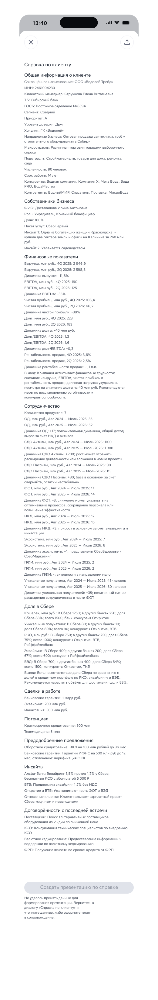
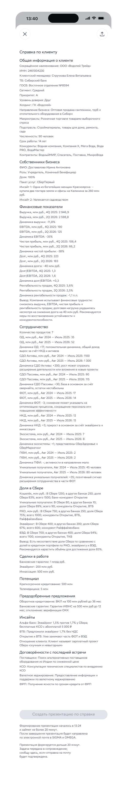
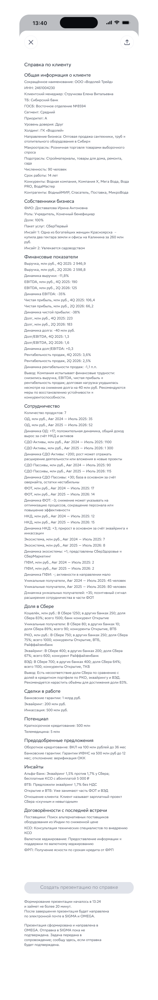

Навигация: [DataCanvas](../../../../../../README.md) / [Документация](../../../../../README.md) / [Путь заказа презентации в Лисе](../../README.md) / Черновые кадры ошибок в 13:40

# Черновые PNG: сообщения об ошибках в 13:40

Статус: три кадра приняты владельцем 2026-08-24. Ни один из них не меняет
действующую демонстрацию, высокий рендер или архив; следующий кадр — письмо —
остаётся заблокированным до получения его редактируемого SVG-источника.

Все кадры продолжают полную справку ООО «Водолей Трейд». Кнопка остаётся
погашенной. В двух последних кадрах перед сообщением ошибки остаётся сообщение
о начале формирования презентации.

## Данные не приняты

> Не удалось принять данные для формирования презентации. Вернитесь к диалогу
> «Справка по клиенту» и уточните данные, либо оформите тикет в сопровождение.

[Открыть карточку кадра](lisa-order-not-accepted-clock-13-40/review.md) ·
[открыть SVG-источник](lisa-order-not-accepted-clock-13-40/source.svg)

## Задержка доставки

> Презентация формируется дольше 20 минут. Задача передана в сопровождение;
> сообщу здесь, если отправка на почту будет подтверждена.

[Открыть карточку кадра](lisa-delivery-delayed-clock-13-40/review.md) ·
[открыть SVG-источник](lisa-delivery-delayed-clock-13-40/source.svg)

## Частичная доставка

> Презентация сформирована и направлена в OMEGA. Отправка в SIGMA пока не
> подтверждена. Задача передана в сопровождение; сообщу здесь, если отправка
> будет подтверждена.

[Открыть карточку кадра](lisa-delivery-partial-clock-13-40/review.md) ·
[открыть SVG-источник](lisa-delivery-partial-clock-13-40/source.svg)

Решение «Экраны приняты!» сохранено в записи приёмки каждого кадра. Общий
черновик прототипа в прежнем разрешении будет подготовлен только после приёмки
всех остальных кадров маршрута.
