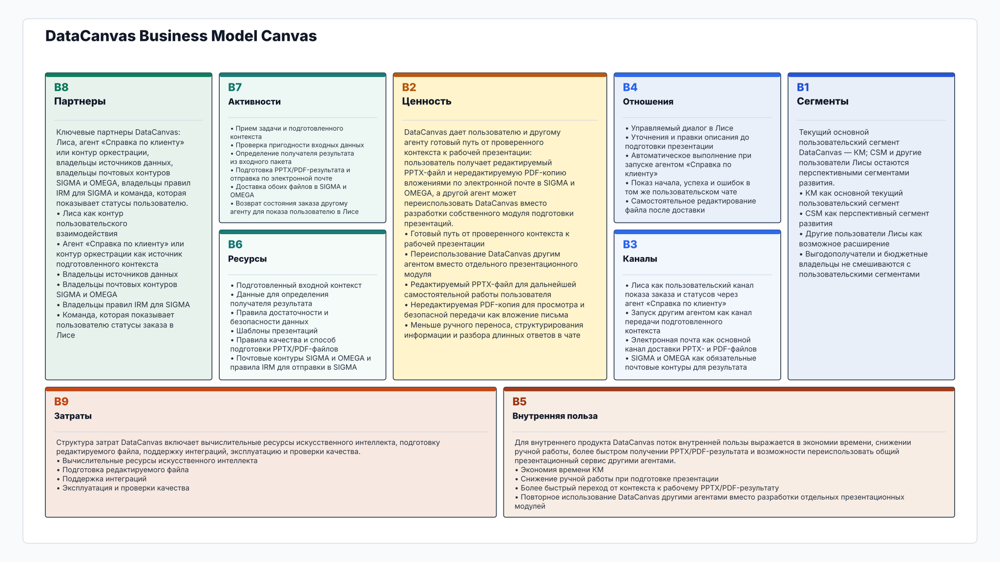
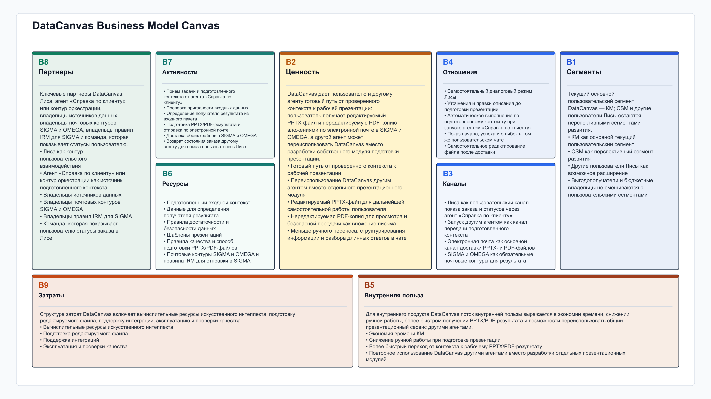

# Business Model Canvas DataCanvas

Навигация: [DataCanvas](../../../README.md) / [Документация](../../README.md) / [Продукт](../README.md) / Business Model Canvas

Основной документ: [открыть Business Model Canvas DataCanvas](bmc-v0.2.md).

Дополнительные представления: [текстовая версия](text-alternative.md) и [схема PlantUML](source/derived/datacanvas-bmc.puml).

## SVG

[Открыть SVG в отдельном окне](source/derived/datacanvas-bmc.svg)

## PNG

[Открыть PNG в отдельном окне](source/derived/datacanvas-bmc.png)

## PDF

[Открыть PDF в отдельном окне](source/derived/datacanvas-bmc.pdf)

Нажмите на изображение, чтобы открыть PDF.

